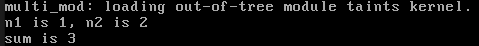
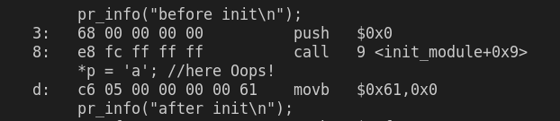
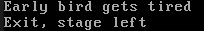
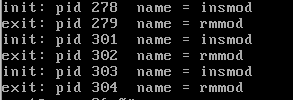
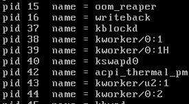
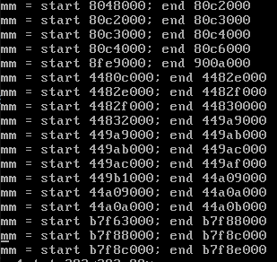
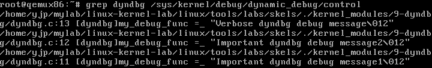
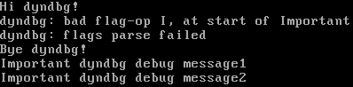

## lab3-Kernel modules

### 实验目标：

- 创建一个简单的模块
- 描述内核模块的编译过程
- 展示模块何如与内核一起使用
- 简单的内核调试方法

### 内核模块总览：

宏内核虽然比微内核快，但是缺乏模块化和可拓展性。在现代的宏内核中，这些缺点已经被内核模块化所解决。内核模块是一个目标文件，作为内核运行时可加载的内容；当不需要内核模块时，可以将其卸载。大多数设备驱动程序以内核模块的形式使用。

#### 内核模块编译&&make menuconfig：

##### menuconfig

- M 会生成可加载的内核模块
- Y  会将生成的模块直接链接到内核中

##### 内核模块编译

```makefile
KDIR = /lib/modules/`uname -r`/build  	#模块生成的地址

kbuild:continue
        make -C $(KDIR) M=`pwd`			

clean:
        make -C $(KDIR) M=`pwd` clean
        
EXTRA_CFLAGS = -Wall -g					#模块的编译时的警告就停止编译和gdb编译信息
obj-m        = supermodule.o			#最终目标文件
supermodule-y = module-a.o module-b.o	#目标文件由右边的目标文件链接而成
```

#### 加载和卸载模块：

```bash
insmod module.ko 	#加载模块
rmmod module.ko		#卸载模块
```

### 内核模块调试：

##### kernel oops：

- 只可能由内核产生的无效操作-->稳定版本内核+自己的模块-->出现oops = 模块有bug

- dmesg：模块输出日志信息，dmesg检查输出的日志信息。`dmesg | tail -32`

- `Oops : xxxx [#1]......` 16位标记了Oops对应的错误信息

  - Bit 0 == 0 -> 页未找到;1 -> 页保护错.
  - Bit 1 == 0 -> 读出错; 1-> 写出错

  ```shell
  Oops: 0002 [#1] PREEMPT DEBUG_PAGEALLOC #错误原因为：写错误
  .........................................................................................
  BUG: unable to handle kernel paging request at 00001234	#错误原因 = 无法访问的地址
  EIP: [<c89d4005>] my_oops_init + 0x5 / 0x20 [oops]	#错误指令 = my_oops_init函数某偏移处
  ```

##### objdump：

- -d = 反汇编；-S = 在汇编中交错C代码

- Oops中的[EIP][\<c89d4005\>\]锁定了 objdump中的错误代码所在的位置。 

- `cat /proc/modules`输出模块加载的地址

- `objdump -dS --adjust-vma=0xc89d4000 oops.ko`反汇编对应的地址的代码段

- ```c
  static int my_oops_init (void)
  {
  c89d4003:       89 e5                   mov    %esp,%ebp
          int *a;
  
          a = (int *) 0x00001234;
  #if OP_OOPS == OP_WRITE
          *a = 3;
  c89d4005:       c7 05 34 12 00 00 03    movl   $0x3,0x1234
  c89d400c:       00 00 00
  #else
  #error "Unknown op for oops!"
  #endif
  
          return 0;
  }
  ```

##### addr2line：

- ```shell
  $ addr2line -e oops.o 0x5 			#指定模块+偏移
  /root/lab-01/modul-oops/oops.c:23	#返回对应源文件的代码行
  ```

##### printk：内核阶段的信息输出方式

### 练习部分

##### 0.Intro：

- module_init()：只会进行一次的模块初始化函数，要么在do_initcalls时被调用(作为内置模块)，要么在模块被插入时调用。
- module_exit()：内置模块这部分代码不会使用，只有在模块退出时才会被调用。
- ignore_loglevel：默认关闭，打开时会把所有打印信息全部打印出来，无视printk的level配置。

##### 4.Sub-modules

- 修改Makefile即可

  ```makefile
  obj-m = multi_mod.o
  multi_mod-y = mod1.o mod2.o
  ```

- 

##### 5.Kernel oops

- 
- 

##### 6. Module parameters

- `insmod cmd_mod.kp str='tired'`
- 模块的参数通过`module_param(str, charp, 0000);`宏来定义
- 

##### 7. Module parameters



##### ex1. KDB:thinking:

- make menuconfig开启kgbd\kdb的配置，再进行5. Dynamic Debugging During Initializationmake

- ```shell
  echo hvc0 > /sys/module/kgdboc/parameters/kgdboc	#设置kgdb的串口链接
  echo g > /proc/sysrq-trigger						#开启kdb调试
  ```

- 能够正常进入kdb调试

- 串口好像出了一点小问题，换个串口试一下。。

##### ex2. PS Module

- `7-list-proc`修改一下，输出所有进程的信息。
- 使用list_head 组成的进程链表，遍历所有task_struct输出信息即可。
  - list_head作为task_struct的成员，可以通过减去固定偏移量的方法得到task_struct的地址
  - 利用Linux***内核第一宏*** `list_entry(p, t, m)`写起来超方便的~
  - 

##### ex3. Memory Info

- `struct task_struct`-->`struct mm_struct`-->`struct vm_area_struct`
- 进程内的所有虚拟内存空间都有一个VMA`vm_area_struct`控制
- `current->mm` = 当前运行的VMA`current->avtive_mm` = 原用户线程的VMA
- `struct vm_area_struct`是从小到达排列的，按序输出，直到遇到null。
- 

##### ex4.Dynamic Debugging

- Dyndbg-debugfs调试文件系统，一般挂载在`/sys/kernel/debug`，将进程数据作为文件进行展示。

  ```c
  char hello[32] = "Hello world!\n";		//程序中的一个参数
  struct debugfs_blob_wrapper a;			//debugfs展示所需要的数据结构
  a.data = (void *)hello;					//初始化数据结构
  a.size = strlen(hello) + 1;				//初始化数据结构
  my_debugfs_root = debugfs_create_dir(``"mydebug"``, NULL);	//在debugfs根目录建文件夹
  sub_dir = debugfs_create_dir("subdir", my_debugfs_root);	//由建了个文件夹
  debugfs_create_u8("a", 0644, my_debugfs_root, &a);	//文件名为a，权限为0644，路径，对象
  ```

- 另外这个文件系统还能通过配置，使`pr_debug()`等调试信息展示的更加清晰。

- `echo 'format "Important" +p' > /sys/kernel/debug/dynamic_debug/control`可以让`pr_debug`的信息中带有Important字段的信息输出到dmesg上。

  - format = 按格式，格式 = Important，+p = 启用

##### ex5. Dynamic Debugging During Initialization

- 初始化的时候就能输出debug信息
- 暂时用不到，就先不学了嘻嘻~

