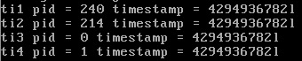
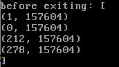
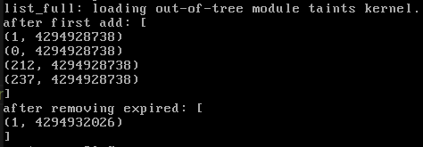
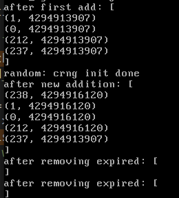

## lab4-Kernel API

### 实验目标：

- 熟悉基本的Linux内核API
- 理解内存分配机制
- 理解锁机制

### 内核编程总览：

##### 地址空间问题 Accessing memory

- 四种不同内存类型：物理内存、内核的虚拟地址空间、用户进程的虚拟地址空间、常住内存

##### 执行环境问题(执行上下文问题) Contexts of execution

- 两种上下文：进程上下文、中断上下文
- 中断上下文不能使用诸如挂起、阻塞等导致上下文切换的内核函数

##### 锁问题 Locking

- 中断上下文只能使用自旋锁(条件变量等锁不能使用)，软中断为保证可重入性，也不能使用自旋锁.tasklet可以

##### 抢占性 Preemptivity

- 处理好上下文的保存和恢复

### Linux内核接口

##### 错误信息宏：

- `include/asm-generic/errno-base.h` and `includes/asm-generic/ernno.h`.

##### 字符串处理：

- `include/linux/string.h` and `lib/string.c`

##### 输出`printk()`：

- `include/linux/printk.h`

##### 内存分配 `kmalloc()` ：

- `include/linux/slab.h`

##### 链表&&链表处理宏：

- `include/linux/list.h`
- `list_entry(ptr, type, member)` and `LIST_HEAD(name)` and `list_for_each(pos, head)` and ......

##### 自旋锁Spinlock：

- `linux/spinlock.h`
- `spin_lock_init()`, `spin_lock()`, `spin_unlock()`.
- 对数据加锁！

##### 互斥锁mutex：

- `linux/mutex.h`
- 只能在进程上下文中使用

##### 原子变量Atomic variables：

- `include/linux/atomic.h`保证了原子性

- ```c
  void atomic_set(atomic_t *v, int i);
  int atomic_read(atomic_t *v);
  void atomic_add(int i, atomic_t *v);
  void atomic_sub(int i, atomic_t *v);
  void atomic_inc(atomic_t *v);
  void atomic_dec(atomic_t *v);
  int atomic_inc_and_test(atomic_t *v);
  int atomic_dec_and_test(atomic_t *v);
  int atomic_cmpxchg(atomic_t *v, int old, int new);
  ```

### 练习部分

1.输出了4096个Z.....

2.持有自旋锁时禁止睡眠。关中断时也禁止睡眠。

- 睡眠意味着等待调度器调度，但调度器的调度行为是依靠时钟中断发起的，关了中断再睡眠，机子就死了。
- 自旋锁提供多种获取锁的方式，有顺带关中断的(在中断处理程序中使用)，也有不关中断的，为了统一管理，所有获取了自旋锁的进程，都禁止睡眠！

3. `usized long jiffies`全局变量！记录从系统启动到目前为止的时钟周期数！



4.`list_for_each` and `list_entry`

5.

6.核心 = 用锁保护数据而不是保护代码段

7.