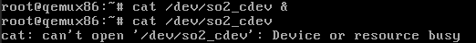
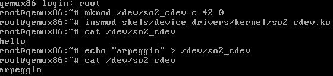
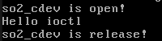
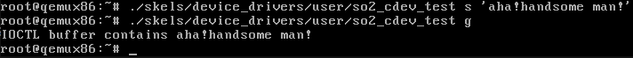
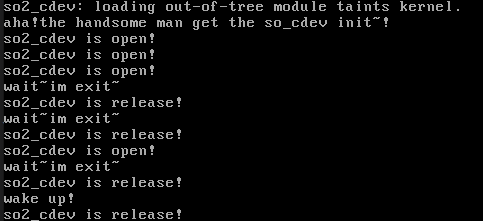
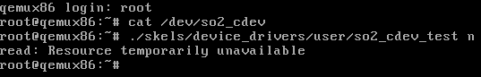

## lab5-Character device drivers

### 实验目标:

- 理解字符设备的概念
- 了解字符设备上执行的各种操作
- 使用等待队列

### 实验总览：

##### 字符设备的交互与设备驱动直接进行。

##### 块设备的交互与文件系统、块设备子系统进行。

##### 设备号

- 主设备号、次设备号 = 设备驱动程序 、具体物理设备

- ```shell
  mknod /dev/mycdev c 42 0	#创建一个字符设备文件，主设备号 = 42，次设备号 = 0
  mknod /dev/mybdev b 240 0	#创建一个块设备文件，主设备号 = 240，次设备号 = 0
  ```

### 字符设备接口：

##### 三大驱动数据结构：

- `struct file_operations` = 操作集合
- `struct file` = 设备当前的状态 --> 用文件这个数据结构描述
- `struct inode` = 设备的唯一标志 --> 主次设备号 

##### `struct file_operations`

```c
#include <linux/fs.h>

struct file_operations {
    struct module *owner;
    loff_t (*llseek) (struct file *, loff_t, int);
    ssize_t (*read) (struct file *, char __user *, size_t, loff_t *);
    ssize_t (*write) (struct file *, const char __user *, size_t, loff_t *);
    [...]
    long (*unlocked_ioctl) (struct file *, unsigned int, unsigned long);
    [...]
    int (*open) (struct inode *, struct file *);
    int (*flush) (struct file *, fl_owner_t id);
    int (*release) (struct inode *, struct file *);
    [...]
```

##### 字符设备的注册与注销

##### 用户空间与内核空间数据的拷贝

##### 4大基本操作+1把瑞士军刀 

- open、release、read、write
- ioctl

##### 等待队列

### 练习部分

##### 1. Register/unregister

##### 2. Register an already registered major

##### 3.Open and close

##### 4. Access restriction

##### 

##### 5.Read operation

- `copy_to_user(to,form,len)`返回值为未完成复制的字符数量！
- len值要取要求拷贝的值size和待拷贝区域的size - offset 的最小值。

##### 6. Write operation



##### 7. ioctl operation



##### ex1.Ioctl with messaging

- 中途碰到了栈粉碎的问题。。`stack smashing detected`，原因是用户程序的缓冲区大小为256B，而驱动的ioctl专用缓冲区错误的使用了4096B，导致copy_to_user的时候导致了栈粉碎。



##### ex2.Ioctl with waiting queues



##### ex3.O_NONBLOCK implementation

把等待队列运用好，变成信号量的形式来激活各个等待队列内的进程。



