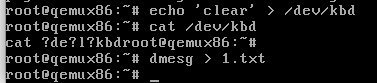

## lab6-I/O access and Interrupts

### 实验目标

- 与外围设备进行通信
- 实现中断处理程序
- 同步中断上下文与进程上下文
- Keywords: IRQ, I/O port, I/O address, base address, UART, request_region, release_region, inb, outb

### 实验总览

##### 四大I/O端口：

- Control、Status、Input、Output
- 内存直接映射、外设地址空间

##### 同步机制问题：

- 中断处理程序、进程、中断处理后半部竞争资源时，不能简单的使用自旋锁，这很容易导致死锁。

##### 访问I/O设备：

- `#include <sys/io.h>`
- `ioperm(MY_BASEPORT, 3, 1)`申请权限
- `outb(value, MY_BASEPORT)`写入数据
- `value = inb(MY_BASEPORT)`输出数据

### 练习部分

##### 1.Request the I/O ports

- 这个任务的目标是让我们理解注册寄存器域。当我们尝试注册已经被注册的寄存器时，会报错，我们的解决方案是注册一个虚假的寄存器域(我们不会使用它)。


##### 2.Interrupt handling routine

- 这个练习的目标是通过共享中断线的方式，使得触发键盘发起中断时，同时处理我们模块的中断处理函数。

##### 3.Store ASCII keys to buffer

- 如果出现接收到的scancode都是一样，比如都是f和n，可能是我们修改了`I8042_DATA_REG`这个宏，导致我们每次读取这个寄存器的值时都错误的读取了其他的位置，解决方案是修改练习1的部分，不直接修改这个宏，而是在注册寄存器域的时候直接写`request_region(0x61, 1, MODULE_NAME)`，让宏的数值保持不变。

##### 4.Reading the buffer

- 仿照put_char写一个get_char。由于我们的buffer区域是与中断共享的，操作这个缓冲区时我们必须关中断并获取自旋锁，这时处于原子上下文所以我们不能使用copy_to_user等函数，这导致了我们复制数据时只能一个字符一个字符的进行复制(当然也可以一组一组的复制，但这会增加判断逻辑)。

##### 5.Reset the buffer

- 这个实验让我们以写文件的方式，来操作我们的设备，注意`echo "clear"`实际的输出，它会输出"clear\n"而不是"clear\0"这意味着我们不能直接的使用`strcmp`等函数，我们需要利用好write时提供的`size`参数。自己完成字符串的比对，并在接受到不正确的指令时(没有接受到clear时)，返回错误信息。
- 

##### ex1.kfifo

- kfifo是内核提供的一个fifo模型。

  - ```c
    struct __kfifo {
    	unsigned int	in;
    	unsigned int	out;
    	unsigned int	mask;
    	unsigned int	esize;
    	void			*data;
    };
    ```

- kfifo会将缓冲区的大小自动拓展到2的幂
  - 速度快：将取模运算化简为与运算`in & esize-1`等效于`in % esize`
  - 判断一个数是否是2的幂 --> `(esize-1 & esize) == 0`
  - in和out只用进行自增运算，不需要额外处理
- kfifo支持无锁的单一写者和单一读者的并发
  - 插入数据时，先将数据写入，再移动in。
  - 输出数据时，先将数据输出，再移动out。
  - 由于执行顺序需要得到保证，需要对这段代码施加内存屏障。
- kfifo也提供了记录模式，可以按序输出一次输入的多条记录，需要使用`kfifo_rec_ptr_1`或  `STRUCT_KFIFO_REC_1`

