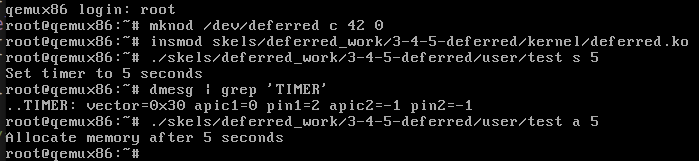
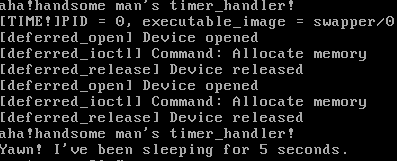
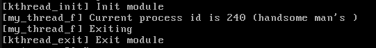

## lab7-Deferred work

### 实验目标

- 理解中断后半部的工作
- 使用中断后半部的功能实现一些常见的任务
- 理解中断后半部中同步机制的特点

- Keywords: softirq, tasklet, struct tasklet_struct, bottom-half handlers, jiffies, HZ, timer, struct timer_list, spin_lock_bh, spin_unlock_bh, workqueue, struct work_struct, kernel thread, events/x

### 实验总览

##### softirq

##### workqueues

##### kernel threads

### 练习部分

##### 2.Periodic timer

- `timer_setup(&timer, timer_handler, 0);`指定时钟对象，指定时钟处理函数
- `mod_timer(&timer, jiffies + TIMER_TIMEOUT * HZ);`指定下次触发时钟处理函数的时机，并激活定时器
- `del_timer_sync(&timer);`停用时钟定时器，可通过`mod_timer`再激活

##### 4.Blocking operations

- `struct my_device_data *my_data = container_of(tl, struct my_device_data, timer);`在中断处理程序中确定data的首地址。

- 中断处理程序中，关中断的情况下睡眠，就永远死机了。因为调度器的触发时依赖与时钟中断的，关中断后，再也没有机会接受时钟中断了，所以永远的死机了，一直等待被调度的死循环中。

  

##### 5. Workqueues

- 任务队列，将后半部的任务交由内核线程完成。
- `INIT_WORK(&my_work, my_work_handler);`初始化任务，绑定任务函数。
- `schedule_work(&my_work);`某一时刻调用函数，让内核线程执行该任务。
- 如果有多个任务需要内核线程执行，则需要使用任务队列。
- `my_workqueue = create_singlethread_workqueue("my_workqueue");`初始化任务队列
- `queue_work(my_workqueue, &my_work);`往任务队列中添加任务



##### 6.Kernel thread

- 内核线程，选择一部分任务交由内核态完成

- ```c
  struct task_struct * kthread_run(int (*threadfn)(void *data)void *data, const char namefmt[], ...); //建立内核线程并将内核线程置为可运行状态
  ```

- 内核线程的退出需要调用`do_exit()`

- 与等待队列`wait_queue_head_t`配合能做很多事情。



##### 7. Buffer shared between timer and process

- 将前面的练习全都再完成一次~
- 可以试一试用任务队列来完成对mon_proc的释放