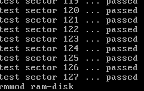
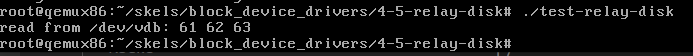
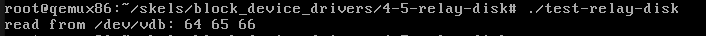
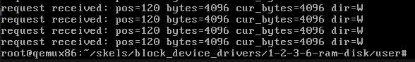

## lab8-Block Device Drivers

### 实验目标：

- 了解Linux的I/O子系统相关的知识
- 通过实验了解块设备的结构和功能
- 通过解决练习获得使用块设备api的基本能力

### 实验总览：

##### 块设备

- 随机访问 + 按块存储 + 性能需求(区别于字符设备)

### 练习部分：

##### 1.Block device

- `register_blkdev(MY_BLOCK_MAJOR, MY_BLKDEV_NAME);`注册块设备
- `unregister_blkdev(MY_BLOCK_MAJOR, MY_BLKDEV_NAME);`注销块设备

##### 2.Disk registration

- `blk_mq_start_request(rq);`开始请求的处理
- `blk_mq_end_request(rq, BLK_STS_OK);`结束请求的处理
- `blk_rq_is_passthrough(rq)`检查请求是否已经被处理
- `blk_rq_pos`起始扇区号宏 `blk_rq_bytes`总字节数宏 `blk_rq_cur_bytes` 当前处理字节数宏 `rq_data_dir`方向宏，标志读或写

##### 3.RAM disk

- `bio_data(rq->bio)`该宏可以确定系统缓冲区的位置

##### 4.Read data from the disk

- `alloc_page` =  分配一个物理页
- `kmap_atomic(page)` = 将一个物理页放入固定插槽，方便后续直接访问

##### 5.Write data to the disk

##### 6. Processing requests from the request queue at `struct bio` level

- 将请求队列中的所有bio请求全部完成

