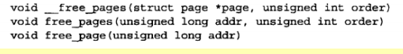
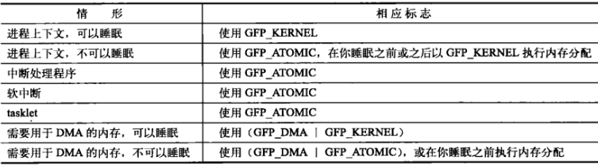
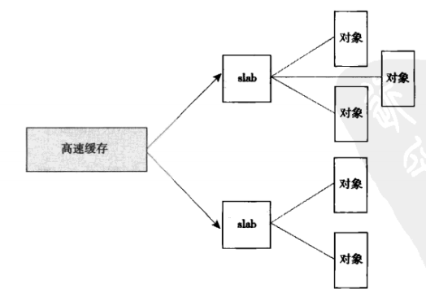
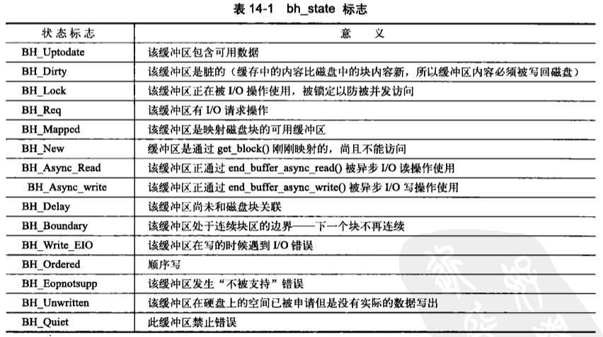
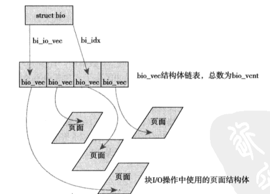
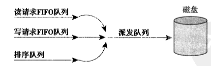

## LKD的补充章节知识

## 第12章 内存管理

#### 基础数据定义

##### 页 = 虚拟内存管理的最小单位

- ##### struct page (反映物理页本身的状态)

  - flags 存储是否脏、是否被锁定
  - _count 被引用计数，为-1时会被回收；内核应该用page_count进行检查，范围0表示空闲，返回正整数表示正在被使用
  - mapping 若被页缓存使用，则指向相关联的eaddresss_space对象
  - virtual 是页的虚拟地址，有些情况这个物理页不在常驻地址(如高端内存)就会时null

##### 区 = 物理地址空间分类 = 划分物理页池

- ZONE_DMA = DMA可使用的物理页
- ZONE_NORMAL = 正常可寻址的物理页
- ZONE_HIGHMEM = 动态映射的物理页
- struct zone
  - 自旋锁
  - 区名
  - 范围
  - 。。。。。

#### 结构数据行为

##### 按页分配 alloc_pages

- struct page *aclloc_pages(gfp_t gfp_mask, unsigned int order) = 分配2^order个页，返回第一个页结构体
- void *page_address(struct page *page) = 根据页结构体，返回其对应的虚地址
- unsigned long __get_free_pages(gfp_t gfp_mask, unsigned int order) = 分配2^order个页直接返回虚地址
- 获取单页 alloc_page(gfp_t gfp_mask) && unsigned long __get_free_page(gfp_t gfp_mask)
- 获取全零页.....
- 释放页

- 内核完全信任自己，如果释放了错误的页，系统将会直接挂起

##### 按需分配 kmalloc\kfree

- void  *kmalloc(size_t size, gfp_t flags)返回满足要求的内存块指针，申请的物理内存是连续的
- void kfree(const void *ptr) 释放kmalloc申请的内存
- void *vmalloc(unsigned long size) 申请的物理内存不一定连续的连续虚存空间(容易产生TLB抖动)
- void vfree(const void *ptr)释放vmalloc申请的内存

##### 分配标志 gfp_mask

- 行为描述符
  - 是否可以睡眠、启动磁盘I/O、启用文件系统I\O、是否无限重复分配、是否只在slab层内部使用等..
- 区描述符
  - DMA、HIGHMEM等
- 类型描述符
  - ATOMIC、KERNEL、USER等



##### 结构高速分配 slab

- 对于一些经常创建、撤销的结构体，为了加速这个过程，跳过每次都分配一个页的麻烦，内核提供了slab机制

- 一个对象类型 = 一个高速缓存组

- 

- 

- ```c
  struct kmem_cache *task_stuct_cachep = kmem_cache_create("task_struct",sizeof(struct task_struct),ARCH_MIN_TASKALIGN,SLAB_APPNIC | SLAB_NOTRACK,NULL);//建立高速缓存组
  struct task_struct *tsk = kmem_cache_alloc(task_struct_cachep, GFP_KERNEL);//快速申请对象
  ```

##### 在栈上分配内存

- 内核栈1页与2页的配置区别：机器运行后期，很难找到两个连续的页，所以有配置可以将内核栈设置为1页。
- 内核栈过小，所以可以进行配置，专门为每个进程设置一个中断栈，减少栈溢出的风险
- 函数内部不要申请过大的静态变量，这会提高栈溢出的风险。

##### 高端内存映射 kmap

- 通过alloc_pages 得到的高端内存没有虚地址，需要映射才能获取其虚地址

- 永久映射[可能阻塞] void *kmap(struct page *page) 和 void kunmap(struct page *page)
- 临时映射[不会阻塞] void *kmap_atomic(struct page *page, enum km_type type)

##### SMP的无锁并发 percpu

- 各个cpu独自持有数据，无锁并发的api——percpu

  - 减少cpu的缓存失效概率，L1命中率提升

- 静态变量

  - DEFINE_PER_CPU(type, name) ---> 定义数据
  - get_cpu_var(name)++ ---> 获取数据，关闭抢占，自增
  - put_cpu_var(name) ---> 开启抢占

- 动态分配

  - alloc_percpu(type)

  - free_percpu(ptr)

  - ```c
    不void *percpu_ptr;
    unsigned long *foo;
    percpu_ptr = alloc_percpu(unsigned long);  
    if(!percpu_ptr)....//分配错误
    foo = ger_cpu_var(percpu_ptr);
    put_cpu_var(percpu_ptr);
    ```

#### 总结

普通分配 = kmalloc

普通分配，不考虑性能，不需要物理页连续 = vmalloc

使用高端内存 = alloc_pages + kmap

频繁使用大量数据结构 = slab

SMP无锁并发 = percpu

## 第14章 块I/O层

#### 基础背景介绍

##### 块I/O子系统

- 块设备不同于字符设备的数据流式处理(只用控制一个位置:当前位置)，块设备更倾向于随机的访问设备地址中的一片数据，所以比字符设备有更高的读写要求。
- 为了应对块设备负责的I/O请求以及速度需求，Linux2.5开发版内核的主要目标就是改写块I/O子系统

##### 块设备

- 硬扇区 = 设备块 = 扇区 = 块设备寻址和操作的基本单元 = 2的幂字节
- 文件块 = I/O块 = 块 = 文件系统的操作访问对象 = 大于扇区大小，小于页大小的数据单元
- ***"块"*** 这一高级概念是建立在 ***"扇区"*** 之上的

#### 基础数据定义

##### 缓冲区和缓冲区头 buffer_head

- 描述缓冲区(内存)与块的映射关系，状态关系(脏？引用计数)等[下表描述了标志位可代表的信息]
- 

##### 块I/O行为描述 bio

- 描述一个完整的块I/O行为的结构体

- 多个块可能映射在不同的缓冲区中，同个缓冲区需要写入到不同的块设备中(RAID)，由一个bio结构体来完整的描述一次I/O行为

- `struct bio_vec *bi_io_vec` = bio_vec数组，描述在不同页面中的块I/O操作。

- ```c
  struct bio_vec {
      struct page		*bv_page;		//缓冲区片段所在页面
      unsigned int 	bv_len;			//片段长度
      unsigned int 	bv_offset;		//片段在缓冲区中的起始位置
  }
  ```

- `bi_idx` 当前正在处理的`bio_vec`片段的数组下标，用于块I/O层跟踪完成进度

- 

##### 请求队列 reques_queue

- 块设备将他们挂起的块I/O请求保存在请求队列中，该队列由reques_queue结构体表示。
- 队列中的请求由结构体request表示，一个请求可能要操作多个连续的磁盘块，而每个请求可以由多个bio结构体组成(多个磁盘块就可能对应多个文件块)。

##### I/O调度程序

- 为了优化性能，内核会对块设备请求进行合并与排序的预操作，以提升性能。经过优化以后，再提交I/O请求，而这部分任务是交由I/O调度程序完成的。

##### I/O调度算法

- Linus电梯调度算法 = 最小盘头移动距离贪心
  - Linus电梯算法换产生饥饿，没考虑读请求被阻塞和写请求被阻塞的差别，读请求应该是更敏感的。
- 最后期限I/O调度算法
  - 读请求超时时间 500ms，写请求超时5s
  - 

- 预测I/O调度算法
  - 在最后期限I/O调度算法的基础上，每次派发一个任务，等待应用程序一会儿，从而让应用程序提交请求，磁盘头就能尽量少的进行移动，从而能让应用程序对连续的I/O请求感受良好
- 完全公正的排队I/O调度算法 CFQ-I/O
  - 每个提交I/O请求的进程都有自己的请求队列，从而实现对每个进程的公平。
- 空操作的调度算法 Noop
  - 除了合并操作，啥也不干。专为随机访问设备设计(SSD)

## lab8-Block Device Drivers

### 实验目标：

- 了解Linux的I/O子系统相关的知识
- 通过实验了解块设备的结构和功能
- 通过解决练习获得使用块设备api的基本能力

### 实验总览：

##### 块设备

- 随机访问 + 按块存储 + 性能需求(区别于字符设备)

### 练习部分：

##### 1.Block device

- `register_blkdev(MY_BLOCK_MAJOR, MY_BLKDEV_NAME);`注册块设备
- `unregister_blkdev(MY_BLOCK_MAJOR, MY_BLKDEV_NAME);`注销块设备

##### 2.Disk registration

- `blk_mq_start_request(rq);`开始请求的处理
- `blk_mq_end_request(rq, BLK_STS_OK);`结束请求的处理
- `blk_rq_is_passthrough(rq)`检查请求是否已经被处理
- `blk_rq_pos`起始扇区号宏 `blk_rq_bytes`总字节数宏 `blk_rq_cur_bytes` 当前处理字节数宏 `rq_data_dir`方向宏，标志读或写


##### 3.RAM disk

- `bio_data(rq->bio)`该宏可以确定系统缓冲区的位置


##### 4.Read data from the disk

- `alloc_page` =  分配一个物理页
- `kmap_atomic(page)` = 将一个物理页放入固定插槽，方便后续直接访问


##### 5.Write data to the disk


##### 6. Processing requests from the request queue at `struct bio` level

- 将请求队列中的所有bio请求全部完成

