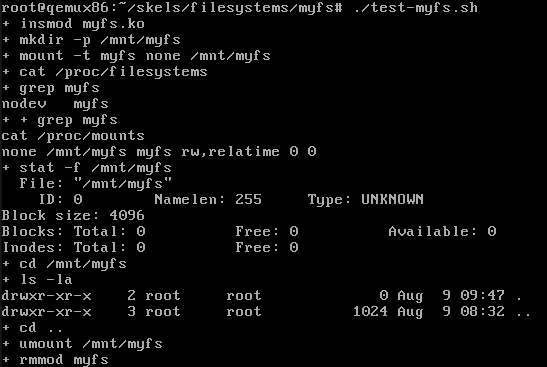

## lab9-File system drivers(1+2)

### 实验目标

- 了解虚拟文件系统的四大对象：inode、dentry、file、superblock和数据块datablock
- 了解VFS中挂载文件系统的过程
- 了解各种文件系统的知识，了解有没有物理支持的文件系统之间的差异
- 提高对于 inode、file 和 dentry 的理解。
- 了解 VFS（虚拟文件系统）中操作常规文件和目录的方法。
- 提升有关文件系统内部实现的认知。

### 练习部分

#### myfs[使用内存文件系统]

##### 1.Register and unregister the myfs file system

- ```c
  //设备驱动中需要定义的文件系统变量
  static struct file_system_type my_fs_type = {
  		.owner			= THIS_MODULE,
          .name           = "myfs",
          .mount          = myfs_mount,
          .kill_sb        = kill_litter_super,
          .fs_flags       = FS_USERNS_MOUNT,
  };
  
  err = register_filesystem(&my_fs_type);	//在init中注册这个文件系统
  unregister_filesystem(&my_fs_type);		//在exir中注销这个文件系统
  
  //文件系统在挂载时会调用的函数，mount_nodev是一个函数模板了，对应于没有物理设备的文件系统，我们
  //需要提供一个super_block填充的函数即可，mount_nodev内部实现会做好alloc_super等数据结构的申请
  static struct dentry *myfs_mount(struct file_system_type *fs_type,
  		int flags, const char *dev_name, void *data)
  {
  	/* TODO 1: call superblock mount function */
  	return mount_nodev(fs_type,flags,data,myfs_fill_super);
  }
  ```

##### 2.Completing myfs superblock

- ```c
  //文件系统各种操作的具体实现，作为super_block的成员，传递给使用super_block的进程
  static const struct super_operations myfs_ops = {
          .statfs         = simple_statfs,
          .drop_inode     = generic_delete_inode,
  };
  
  //上个练习传递的myfs_fill_super函数需要完成super_block的填充，这里就不展示了
  ```

##### 3.Initialize myfs root inode

- ```c
  //上个练习中my_fill_super调用了myfs_get_inode函数，目的是建立该文件系统的根目录。
  struct inode *myfs_get_inode(struct super_block *sb, const struct inode *dir, int mode)
  {
  	struct inode *inode = new_inode(sb);
  	if (!inode)
  		return NULL;
      //填充inode节点的相关数据
  	inode_init_owner(inode, NULL, mode);
  	inode->i_atime = inode->i_mtime = inode->i_ctime = current_time(inode);
  	inode->i_ino = get_next_ino();
      //针对文件类型的inode节点，我们要做一些额外的赋值
  	if (S_ISDIR(mode)) {
          //直接使用Linux提供的模板函数集即可
  		inode->i_op = &simple_dir_inode_operations;	//i_op是与i_node相关的函数集
  		inode->i_fop = &simple_dir_operations;		//i_fop是当前目录下文件相关的函数集
  		//目录文件因为在父目录中有一个目录项，自身也保存了一个指向自己inode的目录项"."
          //所以链接初始值需要+1
  		inc_nlink(inode);
  	}
  
  	return inode;
  }
  ```

##### 4.Test myfs mount and unmount



##### 5.Directory operations

```c
//定义inode的操作函数集
static const struct inode_operations myfs_dir_inode_operations = {
	/* TODO 5: Fill dir inode operations structure. */
	.create = myfs_create,
	.lookup = simple_lookup,
	.link = simple_link,
	.unlink = simple_unlink,
	.mkdir = myfs_mkdir,
	.rmdir = simple_rmdir,
	.mknod = myfs_mknod,
	.rename = simple_rename, //这个很容易忘记写
};
//照抄linux中实现的ramfs的处理函数，完成这些函数的实现
static int myfs_mknod(struct inode *dir,
		struct dentry *dentry, umode_t mode, dev_t dev)
{
	struct inode * inode = myfs_get_inode(dir->i_sb, dir, mode);
	int error = -ENOSPC;

	if (inode) {
		d_instantiate(dentry, inode);//往目录中添加inode节点关联的目录项
		dget(dentry);	//增加引用计数
		error = 0;
		dir->i_mtime = dir->i_ctime = current_time(dir);//记录时间
	}
	return error;
}

static int myfs_create(struct inode *dir, struct dentry *dentry,
		umode_t mode, bool excl)
{
	return myfs_mknod(dir, dentry, mode | S_IFREG, 0);
}
static int myfs_mkdir(struct inode *dir, struct dentry *dentry, umode_t mode)
{
	int retval = myfs_mknod(dir, dentry, mode | S_IFDIR, 0);
	if (!retval)
		inc_nlink(dir);
	return retval;
}

```


##### 6.File operations

```c
//完成文件inode、文件、地址空间的操作函数集。直接使用Linux提供的模板函数即可
//完成这个任务，上个任务唯一的报错信息也会消除！
static const struct file_operations myfs_file_operations = {
	/* TODO 6: Fill file operations structure. */
	.read_iter	= generic_file_read_iter,
	.write_iter	= generic_file_write_iter,
	.mmap		= generic_file_mmap,
	.fsync		= noop_fsync,
	.splice_read	= generic_file_splice_read,
	.splice_write	= iter_file_splice_write,
	.llseek		= generic_file_llseek,
};

static const struct inode_operations myfs_file_inode_operations = {
	/* TODO 6: Fill file inode operations structure. */
	.setattr	= simple_setattr,
	.getattr	= simple_getattr,
};

static const struct address_space_operations myfs_aops = {
	/* TODO 6: Fill address space operations structure. */
	.readpage	= simple_readpage,
	.write_begin	= simple_write_begin,
	.write_end	= simple_write_end,
};

```


#### minfs[使用设备文件系统]

##### 2.Completing minfs superblock

```c
	/* TODO 2: Read block with superblock. It's the first block on
	 * the device, i.e. the block with the index 0. This is the index
	 * to be passed to sb_bread().
	 */
	//不同于myfs的内存文件系统，由于这个文件系统存在与块设备磁盘中，对应的各种信息是保存在磁盘中的，如	//super_block、inode等信息是在磁盘中的，我们需要使用磁盘中的数据对我们的VFS数据进行初始化。
	//超级块填充需要从磁盘中读取对应的信息。
	if (!(bh = sb_bread(s,0)))
		goto out_bad_sb;
	
	/* TODO 2: interpret read data as minfs_super_block */
	ms = (struct minfs_super_block *) bh->b_data;
	/* TODO 2: check magic number with value defined in minfs.h. jump to out_bad_magic if not suitable */
	if (ms->magic != MINFS_MAGIC) goto out_bad_magic;
	/* TODO 2: fill super_block with magic_number, super_operations */
	s->s_magic = MINFS_MAGIC;
	s->s_op = &minfs_ops;
	/* TODO 2: Fill sbi with rest of information from disk superblock
	 * (i.e. version).
	 */
	sbi->version = ms->version;
	sbi->sbh = bh;
	sbi->imap = ms->imap;
```


##### 3.Creating and destroying minfs inodes

```c
//实现磁盘文件系统的inode的创建，供我们参考的minix是通过slab分配器实现的，我们直接使用kzalloc就好。
static struct inode *minfs_alloc_inode(struct super_block *s)
{
	struct minfs_inode_info *mii;

	/* TODO 3: Allocate minfs_inode_info. */
	/* TODO 3: init VFS inode in minfs_inode_info */
	mii = kzalloc(sizeof(struct minfs_inode_info),GFP_KERNEL);
	if (!mii)
		return NULL;
	//这里不进行初始化会有bug
	inode_init_once(&mii->vfs_inode);
	return &mii->vfs_inode;
}

static void minfs_destroy_inode(struct inode *inode)
{
	/* TODO 3: free minfs_inode_info */
	kfree(container_of(inode,struct minfs_inode_info,vfs_inode));
}
```

##### 4.Initialize minfs root inode

```c
//inode信息存储于磁盘中，通过读取磁盘，并使用块设备缓冲区buffer_head中的数据，对VFS的inode对象进行赋值
	/* TODO 4: Read block with inodes. It's the second block on
	 * the device, i.e. the block with the index 1. This is the index
	 * to be passed to sb_bread().
	 */
	if (!(bh = sb_bread(s,1)))
		goto out_bad_sb;
	/* TODO 4: Get inode with index ino from the block. */
	mi = (struct minfs_inode *)bh->b_data;
	/* TODO 4: fill VFS inode */
	//[BUG]这边有风险，后面肯定得改的！
	//由于是使用简单的磁盘设备，我们假设，i节点所占的大小不会超过一个块的大小
	//实际情况，这里肯定时需要进行边界检测等操作的！
	inode->i_mode = mi[ino].mode;
	i_uid_write(inode, mi[ino].gid);
	i_gid_write(inode, mi[ino].gid);
	inode->i_size = mi[ino].size;
	inode->i_ino = ino;
	inode->i_atime = inode->i_ctime = inode->i_mtime = current_time(inode);

	/* TODO 7: Fill address space operations (inode->i_mapping->a_ops) */

	if (S_ISDIR(inode->i_mode)) {
		/* TODO 4: Fill dir inode operations. */
		inode->i_op = &simple_dir_inode_operations;
		inode->i_fop = &simple_dir_operations;
		/* TODO 4: Directory inodes start off with i_nlink == 2.
		 * (use inc_link) */
		inc_nlink(inode);
	}
	/* fill data for mii */
	mii = container_of(inode, struct minfs_inode_info, vfs_inode);

	/* TODO 4: uncomment after the minfs_inode is initialized */
	mii->data_block = mi->data_block;

	/* Free resources. */
	//使用完毕解除块设备缓冲区的引用。
	brelse(bh);
```

##### 5.Testing of minfs mount and unmount


##### 6.Iterate operation

```c
//从磁盘中读取目录文件，通过目录文件的迭代器dir_context记录已扫描的目录项，找到目录项就返回。
//dir_context的设计可以让用户程序实现很好的定制化，比如不输出隐藏项'.'和'..'就可以将ctx的初始值设为2
static int minfs_readdir(struct file *filp, struct dir_context *ctx)
{
//............................................................................
	/* TODO 5: Get inode of directory and container inode. */
	inode = file_inode(filp);
	/* TODO 5: Get superblock from inode (i_sb). */
	sb = inode->i_sb;
	/* TODO 5: Read data block for directory inode. */
	mii = container_of(inode,struct minfs_inode_info, vfs_inode);
	bh = sb_bread(sb,mii->data_block);
	for (; ctx->pos < MINFS_NUM_ENTRIES; ctx->pos++) {
		/* TODO 5: Data block contains an array of
		 * "struct minfs_dir_entry". Use `de' for storing.
		 */
		de = (struct minfs_dir_entry *)bh->b_data + ctx->pos;
		/* TODO 5: Step over empty entries (de->ino == 0). */
//............................................................................
    }
done:
	brelse(bh);
out_bad_sb:
	return err;
}
```

- 
- 这里为什么会有这条错误信息，是因为`ls -l`这个用户程序，不单单是读取目录项，还会读取目录项对应的文件的inode，从而获取文件的其他信息(用户权限，创建者用户等)

##### 7.Lookup operation

```c
/*整体逻辑要从minfs_lookup这个函数说起，这个函数的任务是在一个目录文件中查找一个文件，调用者需要传递一个只初始化了文件名的目录对象dentry，函数如果找到了对应的文件，就会初始化完成这个dentry，并返回这个dentry的地址，同时会将这个dentry缓存(文件访问的时空局部性)。
minfs_lookup已经基本写好了，我们需要修改的部分集中在minfs_find_entry这个函数上。
minfs_find_entry的目标就是根据dentry对象传递的信息，在目录文件中找到对应的目录项，从而该文件的inode信息
*/
static struct minfs_dir_entry *minfs_find_entry(struct dentry *dentry,
		struct buffer_head **bhp)
{
//..................................................................

	/* TODO 6: Read parent folder data block (contains dentries).
	 * Fill bhp with return value.
	 */
	if (!(*bhp = bh = sb_bread(sb,mii->data_block)))
	{
		printk(LOG_LEVEL "could not read block\n");
		return  NULL;
	}
	de = (struct minfs_dir_entry *)bh->b_data;
	for (i = 0; i < MINFS_NUM_ENTRIES; i++) {
		/* TODO 6: Traverse all entries, find entry by name
		 * Use `de' to traverse. Use `final_de' to store dentry
		 * found, if existing.
		 */
		if(de[i].ino == 0) continue;
		if(strcmp(de[i].name,name) == 0) 
		{
			final_de = de+i;
			break;
		}
	}
	/* bh needs to be released by caller. */
	return final_de;
}
```


##### 8.Create operation

```c
//文件的建立涉及到写回磁盘，磁盘文件绑定VFS的inode，目录项录入等
static struct inode *minfs_new_inode(struct inode *dir)
{
	struct super_block *sb = dir->i_sb;
	struct minfs_sb_info *sbi = sb->s_fs_info;
	struct inode *inode;
	int idx;

	/* TODO 7: Find first available inode. */
	idx = find_first_zero_bit(&sbi->imap,sizeof(sbi->imap));
	
	/* TODO 7: Mark the inode as used in the bitmap and mark
	 * the superblock buffer head as dirty.
	 */
	set_bit(idx,&sbi->imap);
	mark_buffer_dirty(sbi->sbh);
	/* TODO 7: Call new_inode(), fill inode fields
	 * and insert inode into inode hash table.
	 */
	inode = new_inode(sb);
	inode_init_owner(inode,dir,0);
	inode->i_ino = idx;
	inode->i_mtime = inode->i_atime = inode->i_ctime = current_time(inode);
	inode->i_blocks = 0;
	insert_inode_hash(inode);
	mark_inode_dirty(inode);
	/* Actual writing to the disk will be done in minfs_write_inode,
	 * which will be called at a later time.
	 */

	return inode;
}

/*
 * Add dentry link on parent inode disk structure.
 */

static int minfs_add_link(struct dentry *dentry, struct inode *inode)
{
	struct buffer_head *bh;
	struct inode *dir;
	struct super_block *sb;
	struct minfs_inode_info *mii;
	struct minfs_dir_entry *de;
	int i;
	int err = 0;

	/* TODO 7: Get: directory inode (in inode); containing inode (in mii); superblock (in sb). */
	dir = dentry->d_parent->d_inode;
	mii = container_of(dir,struct minfs_inode_info,vfs_inode);
	sb = dir->i_sb;
	/* TODO 7: Read dir data block (use sb_bread). */
	bh = sb_bread(sb,mii->data_block);
	/* TODO 7: Find first free dentry (de->ino == 0). */
	for(i=0; i < MINFS_NUM_ENTRIES; i++)
	{
		de = (struct minfs_dir_entry *)bh->b_data + i;
		if(de->ino == 0)
		{
			de->ino = inode->i_ino;
			strcpy(de->name,dentry->d_name.name);
			break;
		}
	}
	if(i == MINFS_NUM_ENTRIES) return -ENOSPC;
	/* TODO 7: Place new entry in the available slot. Mark buffer_head
	 * as dirty. */
	mark_buffer_dirty(bh);
out:
	brelse(bh);

	return err;
}
```


## 